# Craft.md Operational Enhancements

**Date**: 2025-10-12
**Session**: Operational Directives & UX Philosophy Enhancement

## Overview

Enhanced craft.md with critical operational directives and UX philosophy to improve execution quality and prevent common operational errors.

## Changes Completed

### 1. Empathic "Craft Mindset" Directive (+13 lines)

**Location**: Lines 594-607 (after directory establishment, before Phase 1)

**Content Added:**
```markdown
## Remember: The Craft Mindset

This is iterative quality-driven development. The goal isn't to complete
phases quickly - it's to build something that works and makes sense, grounded
in deep understanding.

**Take your time. Be thorough. Be thoughtful.**

- Understanding comes first: Deep comprehension enables elegant solutions
- Iteration is strength: Revisiting decisions with new insights is growth
- Quality gates protect you: They catch gaps before costly mistakes
- The user is your partner: When uncertain, ask
- Trust the process: Each stage builds on the last
```

**Why This Matters:**
- Sets empathic, thoughtful tone for the entire workflow
- Emphasizes understanding over speed
- Frames iteration as strength, not failure
- Establishes user as collaborative partner
- Builds confidence in the structured approach

### 2. Critical Directory Isolation & Path Discipline (+41 lines)

**Location**: Lines 611-651 (immediately after Craft Mindset, before Phase 1)

**ABSOLUTE RULES:**
```markdown
## ⚠️ CRITICAL: Directory Isolation & Path Discipline

🚫 NEVER change directories:
- ❌ DO NOT use `cd`
- ❌ DO NOT use `pushd` or `popd`
- ❌ DO NOT change working directory in any way

✅ ALWAYS use full paths:
- ✅ All file operations MUST prefix with `<worktree>`
- ✅ All git operations MUST use: `git -C "<worktree>" [command]`
- ✅ All paths MUST be absolute, never relative
```

**Examples Provided:**
```bash
# CORRECT
Write: "<worktree>/planning/requirements.md"
Read: "<worktree>/src/module.js"
Git: git -C "<worktree>" status

# WRONG
cd <worktree>           # ❌ NEVER
git status              # ❌ NEVER (missing -C)
../planning/file.md     # ❌ NEVER (relative path)
```

**Why This Matters:**
- Prevents directory state corruption across operations
- Enables parallel operations without conflicts
- Ensures operations target correct worktree
- Maintains isolation from original project location

### 3. GUIDE.md Template: Directory Isolation Directive (+35 lines)

**Location**: Lines 432-466 (in GUIDE.md template, after "How to Progress Through This Journey")

**Added Section:**
```markdown
## ⚠️ Critical Operational Rules: Directory Isolation

**ABSOLUTE RULES - NO EXCEPTIONS:**

🚫 NEVER change directories:
- ❌ DO NOT use `cd` command
- ❌ DO NOT use `pushd` or `popd` commands
- ❌ DO NOT change working directory in any way

✅ ALWAYS use full paths with `<worktree>` prefix:
- ✅ File operations: "<worktree>/planning/file.md"
- ✅ Git operations: git -C "<worktree>" [command]
- ✅ All paths must be absolute, never relative
```

**Why Include in GUIDE.md:**
- Ensures context-lost sessions see critical operational rules
- Prevents common mistakes during session resumption
- Makes rules visible in every worktree's GUIDE.md
- Reinforces discipline throughout entire workflow

### 4. GUIDE.md Template: Visual Workflow Mermaid Chart (+38 lines)

**Location**: Lines 217-254 (in GUIDE.md template, at start of "Current Session State")

**Mermaid Chart Added:**

```mermaid
graph TD
    Start[🌱 Start: Task Description] --> P1[Phase 1: Understanding]
    P1 --> S1[Stage 1: Use Cases]
    S1 --> S2[Stage 2: Requirements]
    S2 --> S3[Stage 3: Architecture]
    S3 --> S4[Stage 4: Assumptions]
    S4 --> S5[Stage 5: Effects & Boundaries]
    S5 --> S6[Stage 6: Synthesis]
    S6 --> P2[Phase 2: Planning]
    P2 --> P2A[Phase 2: Quality Criteria]
    P2A --> P2B[Phase 2-B: Test Plan]
    P2B --> P2C[Phase 2-C: Infrastructure]
    P2C --> P2D[Phase 2-D: Task Breakdown]
    P2D --> Gate[🚪 Pre-Implementation Gate]
    Gate -->|Pass| P3[Phase 3: Implementation]
    Gate -->|Fail| Review[Review & Fix Issues]
    Review --> P1
    P3 --> Loop[Task Loop: Plan→Experiment→TDD→Verify]
    Loop -->|More Tasks| Loop
    Loop -->|All Complete| P4[Phase 4: Delivery]
    P4 --> Done[✅ Complete]

    style Start fill:#e1f5e1
    style Done fill:#e1f5e1
    style Gate fill:#fff3cd
    style P3 fill:#cfe2ff
```


**Update Directive:**
```markdown
⚠️ DIRECTIVE: Update this chart when workflow changes
- Add/remove stages or phases as they evolve
- Highlight current position with `style CurrentNode fill:#ffcccc`
- Update connections if dependencies or gates change
- Keep visual representation synchronized with actual progress
```

**Why This Matters:**
- Provides immediate visual orientation for context-lost sessions
- Shows complete workflow at a glance
- Highlights quality gates and iteration loops
- Makes complex workflow understandable
- Directive ensures chart stays current

### 5. UX Enhancement Philosophy in UI Research (+43 lines)

**Location**: Lines 6998-7040 (Phase 2-D, in UI Research section, before "Finalize implementation scope")

**Philosophy Added:**
```markdown
🎨 UX Enhancement Philosophy:

Bias toward modern, polished, enhanced user experiences while respecting
architectural and technical constraints:

Favor Enhanced UX When:
✅ Modern UI libraries/components available that match tech stack
✅ Animations/transitions improve clarity without performance cost
✅ Progressive enhancement possible (works without JS, better with it)
✅ Accessibility enhancements available (ARIA, keyboard nav, screen readers)
✅ Responsive design patterns well-supported by framework
✅ Loading states, skeleton screens, optimistic updates feasible
✅ Micro-interactions provide feedback (hover, active, focus)
✅ Error recovery patterns improve confidence (undo, retry, clear messages)

Respect Constraints:
⚠️ Architecture decisions override aesthetic preferences
⚠️ Performance budgets respected (bundle size, load time, runtime)
⚠️ Browser support requirements honored (polyfills, graceful degradation)
⚠️ Security requirements non-negotiable (XSS, CSRF, input sanitization)
⚠️ Existing design system followed if one exists (consistency over novelty)
```

**Ask During Research:**
- "What's the most polished, delightful way users experience this interaction?"
- "What modern libraries or patterns make this feel professional?"
- "How can we add polish without violating architectural decisions?"
- "What small enhancements create outsized UX improvement?"

**Example Enhancements (when feasible):**
- Toast notifications instead of alert() dialogs
- Skeleton screens instead of blank loading states
- Inline validation with helpful messaging
- Optimistic updates with rollback
- Smooth transitions between states
- Keyboard shortcuts for power users
- Empty states with helpful guidance
- Progress indicators for multi-step workflows

**Why This Matters:**
- Biases toward modern, polished UX by default
- Respects architectural and technical constraints explicitly
- Provides concrete examples of enhancements
- Guides research toward delightful experiences
- Balances aesthetics with pragmatism

## Impact

**File Growth:**
- Starting: 10,684 lines
- Final: 10,839 lines
- **Added: +155 lines (+1.4%)**

**Enhancement Breakdown:**
| Enhancement | Lines | Purpose |
|-------------|-------|---------|
| Empathic Craft Mindset | 13 | Sets thoughtful, collaborative tone |
| Directory Isolation (craft.md) | 41 | Critical operational safety rules |
| Directory Isolation (GUIDE.md) | 35 | Context-lost session protection |
| Mermaid Workflow Chart | 38 | Visual workflow orientation |
| UX Enhancement Philosophy | 43 | Modern UX bias within constraints |
| Spacing/formatting | -15 | Optimization |
| **Total** | **155** | **Operational safety + UX quality** |

## Why These Enhancements Matter

### Before Enhancements

**Operational Issues:**
- Directory changes caused worktree corruption
- Relative paths broke parallel operations
- `cd` commands lost isolation guarantees
- Context-lost sessions had no operational guidance

**UX Design:**
- No explicit guidance on UX quality level
- Unclear how to balance polish vs constraints
- No examples of modern vs basic patterns
- Research didn't bias toward enhanced experiences

### After Enhancements

**Operational Safety:**
- ✅ Explicit prohibition of `cd`/`pushd`/`popd`
- ✅ Required `<worktree>` prefix on all paths
- ✅ Required `git -C "<worktree>"` for all git ops
- ✅ Examples of correct and incorrect patterns
- ✅ Rationale explains why rules exist
- ✅ GUIDE.md includes rules for context-lost sessions

**Enhanced UX Quality:**
- ✅ Explicit bias toward modern, polished experiences
- ✅ Respects architectural and technical constraints
- ✅ Provides concrete enhancement examples
- ✅ Guides research questions toward delightful UX
- ✅ Documents enhancement decisions with rationale

**Visual Navigation:**
- ✅ Mermaid chart provides workflow overview
- ✅ Update directive keeps chart current
- ✅ Color-coded workflow states
- ✅ Shows quality gates and iteration loops

**Empathic Tone:**
- ✅ Sets thoughtful, collaborative mindset
- ✅ Emphasizes understanding over speed
- ✅ Frames iteration as strength
- ✅ Establishes user as partner

## Benefits by Role

**For Claude (AI Agent):**
- Clear operational rules prevent directory corruption
- Visual chart aids navigation through complex workflow
- UX philosophy guides enhancement decisions
- Empathic tone sets appropriate pacing

**For Users:**
- Context-lost sessions can rebuild understanding via GUIDE.md
- Visual chart shows progress at a glance
- Enhanced UX ensures polished deliverables
- Empathic mindset reduces pressure to rush

**For Projects:**
- Directory isolation enables safe parallel worktrees
- UX philosophy ensures consistent quality level
- Operational rules prevent costly mistakes
- Visual documentation aids team coordination

## Verification

To verify these enhancements work in practice:

1. ✅ Start new craft session with `/craft` command
2. ✅ Observe "Remember: The Craft Mindset" section before Phase 1
3. ✅ Check "Directory Isolation & Path Discipline" critical rules
4. ✅ Verify GUIDE.md template includes operational rules
5. ✅ Confirm GUIDE.md has Mermaid workflow chart with update directive
6. ✅ For UI tasks, check UX Enhancement Philosophy in research phase
7. ✅ Validate all examples show `<worktree>` prefix and `git -C` usage

## Conclusion

These operational enhancements transform craft.md from a structured workflow into a **safe, empathic, quality-focused development system** that:

**Prevents Mistakes:**
- Directory isolation rules prevent corruption
- Explicit prohibitions with examples
- Critical warnings at workflow start

**Enhances Quality:**
- UX philosophy biases toward polish
- Respects constraints explicitly
- Provides concrete enhancement examples

**Improves Navigation:**
- Mermaid chart visualizes workflow
- Update directive keeps documentation current
- Color-coded states aid understanding

**Sets Proper Tone:**
- Empathic mindset reduces rushing
- Iteration framed as strength
- User positioned as collaborative partner

**Result:** A robust operational framework that protects against common errors while guiding toward high-quality, polished deliverables with appropriate pacing and thoughtfulness.

**Total Enhancement:** +155 lines (+1.4%) adding critical operational safety, visual navigation, UX quality philosophy, and empathic guidance to craft.md workflow.
