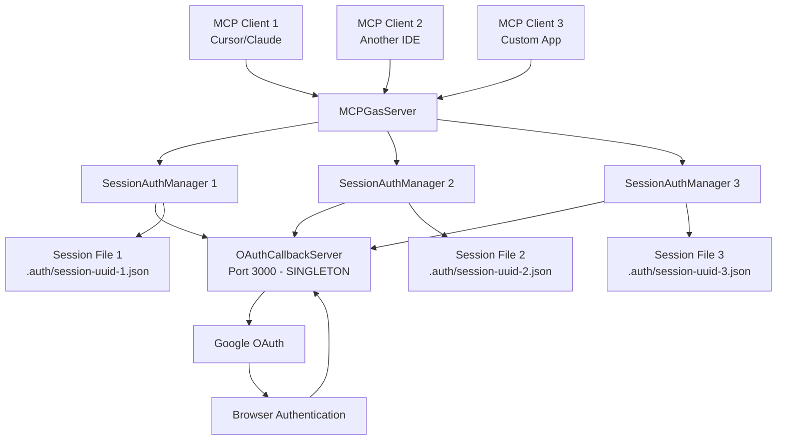

# OAuth Singleton Architecture & Development Guide

## 🎯 Overview

This guide provides comprehensive documentation of the MCP Gas Server's **singleton OAuth callback architecture**, designed to optimize development workflows with AI assistants like Claude in Cursor IDE.

## 🏗️ Singleton OAuth Architecture

### Why Singleton Design?

The MCP Gas Server uses a **singleton OAuth callback server** architecture due to fundamental OAuth 2.0 constraints:

#### 🔒 OAuth 2.0 Requirements
- **Fixed Redirect URI**: Google OAuth requires exact URI match: `http://localhost:3000/oauth/callback`
- **Port Binding**: Cannot use random ports - OAuth will reject mismatched URIs
- **Security Validation**: Google validates the redirect URI against registered OAuth application
- **Browser Integration**: Callback must be accessible from user's browser after OAuth consent

#### 🌐 Multi-Session Challenge
- **Multiple MCP Clients**: Each Cursor/Claude instance needs isolated authentication
- **Shared Callback Endpoint**: All sessions must use the same callback URL
- **Session Isolation**: Each client needs independent token storage and management
- **Concurrent Authentication**: Multiple users may authenticate simultaneously

### Architecture Components



## 🔧 OAuth Callback Server Implementation

### Singleton Port Management

```typescript
/**
 * OAuth Callback Server - SINGLETON DESIGN
 * 
 * Critical Requirements:
 * - MUST use port 3000 (hardcoded in Google OAuth config)
 * - Single instance shared across all sessions
 * - Handles concurrent authentication requests
 * - Graceful startup/shutdown management
 */
export class OAuthCallbackServer {
  private static instance: OAuthCallbackServer | null = null;
  private server: Server | null = null;
  private port: number = 3000; // FIXED - cannot be changed
  private pendingCallbacks: Map<string, CallbackResolver> = new Map();
  
  constructor(port: number = 3000) {
    // Port 3000 is REQUIRED for OAuth - cannot use random ports
    if (port !== 3000) {
      console.warn('⚠️  OAuth callback server should use port 3000 for Google OAuth compatibility');
    }
    this.port = port;
  }
  
  /**
   * Get singleton instance (shared across all sessions)
   */
  static getInstance(): OAuthCallbackServer {
    if (!OAuthCallbackServer.instance) {
      OAuthCallbackServer.instance = new OAuthCallbackServer(3000);
    }
    return OAuthCallbackServer.instance;
  }
}
```

### Port Conflict Resolution

```typescript
/**
 * Port Conflict Handling Strategy
 * 
 * When port 3000 is already in use:
 * 1. Check if it's another MCP Gas instance
 * 2. Attempt graceful connection sharing
 * 3. Provide clear error messages with resolution steps
 * 4. Offer development workflow guidance
 */
async start(): Promise<void> {
  try {
    await this.startServer();
  } catch (error: any) {
    if (error.code === 'EADDRINUSE') {
      throw new OAuthError(
        `Port 3000 is already in use. This is required for OAuth callbacks.\n\n` +
        `Resolution steps:\n` +
        `1. Check if another MCP Gas server is running: ps aux | grep mcp\n` +
        `2. Stop conflicting process: kill <pid>\n` +
        `3. Or restart your development environment\n` +
        `4. OAuth callbacks MUST use port 3000 - cannot use alternative ports`,
        'authorization'
      );
    }
    throw error;
  }
}
```

## 🔄 Session Management Architecture

### File-Based Session Persistence

```typescript
/**
 * Session Management - File-Based Persistence
 * 
 * Each MCP client gets an isolated session with:
 * - Unique UUID identifier
 * - Separate token storage file
 * - Independent authentication state
 * - 24-hour session timeout
 */
interface SessionFile {
  sessionId: string;              // UUID identifier
  userId: string;                 // Google user ID (email)
  accessToken: string;            // OAuth access token
  refreshToken: string;           // OAuth refresh token
  tokenExpiry: number;            // Token expiration timestamp
  createdAt: number;              // Session creation time
  lastUsed: number;               // Last access time
}

// File location: .auth/sessions/{sessionId}.json
const SESSION_PATH = `.auth/sessions/${sessionId}.json`;
```

### Session Lifecycle Management

```typescript
/**
 * Session Creation and Reuse Logic
 */
class SessionAuthManager {
  constructor(sessionId?: string) {
    // 1. Reuse existing session if sessionId provided and valid
    if (sessionId && this.sessionExists(sessionId)) {
      this.sessionId = sessionId;
      this.loadSessionFromFile();
      return;
    }
    
    // 2. Create new session with UUID
    this.sessionId = randomUUID();
    this.initializeNewSession();
  }
  
  /**
   * Session Cleanup Strategy
   * - 24-hour session timeout
   * - Automatic cleanup on server startup
   * - Manual cleanup for expired sessions
   */
  static cleanupExpiredSessions(): number {
    const sessionDir = '.auth/sessions/';
    const files = fs.readdirSync(sessionDir);
    const now = Date.now();
    const timeout = 24 * 60 * 60 * 1000; // 24 hours
    let cleaned = 0;
    
    for (const file of files) {
      const sessionData = this.loadSessionFile(file);
      if (now - sessionData.lastUsed > timeout) {
        fs.unlinkSync(path.join(sessionDir, file));
        cleaned++;
      }
    }
    
    return cleaned;
  }
}
```

## 🚀 Development Workflows

### 1. Local Development Setup

#### Initial Setup
```bash
# 1. Clone and install
git clone <repository-url>
cd mcp_gas
npm install

# 2. Build the project
npm run build

# 3. Start development server
npm run dev  # Uses TypeScript watch mode
```

#### OAuth Configuration
```bash
# 1. Configure Google OAuth credentials
cp config/oauth.json.example config/oauth.json
# Edit config/oauth.json with your OAuth credentials

# 2. Ensure redirect URI is configured in Google Cloud Console:
# http://localhost:3000/oauth/callback
```

### 2. Multi-Client Development

#### Scenario: Multiple Cursor/Claude Instances

```typescript
// Client 1 (Cursor Instance 1)
await callTool('gas_auth', { 
  mode: 'start',
  sessionId: 'cursor-instance-1'  // Optional explicit session ID
});

// Client 2 (Cursor Instance 2) 
await callTool('gas_auth', {
  mode: 'start', 
  sessionId: 'cursor-instance-2'  // Different session ID
});

// Sessions are automatically isolated:
// - cursor-instance-1 → .auth/sessions/cursor-instance-1.json
// - cursor-instance-2 → .auth/sessions/cursor-instance-2.json
```

#### Session Status Checking
```typescript
// Check authentication status without triggering auth flow
const status = await callTool('gas_auth', { 
  mode: 'status',
  sessionId: 'my-session-id' 
});

console.log(status);
// {
//   authenticated: true,
//   user: "user@example.com",
//   sessionId: "my-session-id",
//   tokenExpiry: "2024-01-15T10:30:00Z"
// }
```

### 3. Testing Workflows

#### Unit Testing (No OAuth)
```bash
# Run tests that don't require authentication
npm run test:unit
npm run test:core
```

#### Integration Testing (With OAuth)
```bash
# 1. Set up test environment
export MCP_TEST_MODE=true  # Disables auto-auth
export GAS_INTEGRATION_TEST=true

# 2. Authenticate once for testing
npm start &  # Start server in background
# Complete OAuth in browser manually

# 3. Run integration tests
npm run test:workflow
npm run test:proxy-live
```

#### Test Mode OAuth Behavior
```typescript
// In test mode, auto-authentication is disabled
if (process.env.MCP_TEST_MODE === 'true') {
  // Auto-auth is skipped to prevent browser conflicts
  // Tests must handle authentication manually
}
```

### 4. Production Deployment

#### Environment Setup
```bash
# 1. Production build
npm run build

# 2. Set production environment
export NODE_ENV=production

# 3. Configure OAuth for production domain
# Update redirect URI in Google Cloud Console if needed

# 4. Start production server
npm start
```

#### MCP Client Configuration
```json
{
  "mcpServers": {
    "mcp-gas": {
      "command": "node",
      "args": ["/path/to/mcp_gas/dist/src/index.js"],
      "env": {
        "NODE_ENV": "production"
      }
    }
  }
}
```

## 🛠️ Troubleshooting Guide

### Common Issues and Solutions

#### 1. Port 3000 Already in Use

**Symptoms:**
```
Error: Port 3000 is already in use
OAuth callback server failed to start
```

**Solutions:**
```bash
# Check what's using port 3000
sudo lsof -i :3000

# Kill conflicting process
sudo kill <pid>

# Check for other MCP Gas instances
ps aux | grep mcp

# Force kill if needed
pkill -f "mcp"
```

#### 2. OAuth Redirect URI Mismatch

**Symptoms:**
```
OAuth error: redirect_uri_mismatch
The redirect URI in the request does not match
```

**Solutions:**
1. **Verify Google Cloud Console configuration:**
   - Go to APIs & Services → Credentials
   - Edit OAuth 2.0 Client ID
   - Ensure Authorized redirect URIs includes: `http://localhost:3000/oauth/callback`

2. **Check local server configuration:**
   ```typescript
   // Verify callback server is using correct port
   const callbackUrl = server.getCallbackUrl();
   console.log('Callback URL:', callbackUrl); // Should be http://localhost:3000/oauth/callback
   ```

#### 3. Session File Corruption

**Symptoms:**
```
Authentication required despite recent login
Session file unreadable
```

**Solutions:**
```bash
# Clear all sessions and start fresh
rm -rf .auth/sessions/
mkdir -p .auth/sessions/

# Restart server and re-authenticate
npm start
```

#### 4. Multiple OAuth Windows

**Symptoms:**
- Multiple browser windows opening
- Conflicting authentication flows
- Sessions getting mixed up

**Solutions:**
```typescript
// Use explicit session IDs to prevent conflicts
await callTool('gas_auth', {
  mode: 'start',
  sessionId: 'unique-session-identifier',
  openBrowser: true
});

// Close other browser windows before authenticating
// Complete one OAuth flow at a time
```

### 5. Browser Auto-Close Issues

**Symptoms:**
- Browser window doesn't close after OAuth
- Manual close required

**Solutions:**
- This is expected behavior due to browser security
- The callback page provides a manual close button
- This doesn't affect functionality - authentication completes successfully

## 🔒 Security Considerations

### OAuth Security Best Practices

#### 1. Redirect URI Validation
```typescript
// Server validates callback URLs to prevent attacks
const validRedirectUris = ['http://localhost:3000/oauth/callback'];
if (!validRedirectUris.includes(request.redirectUri)) {
  throw new SecurityError('Invalid redirect URI');
}
```

#### 2. State Parameter Usage
```typescript
// Generate random state for CSRF protection
const state = crypto.randomBytes(32).toString('hex');
const authUrl = oauth.generateAuthUrl({
  scope: SCOPES,
  state: state,
  // ... other parameters
});

// Validate state in callback
if (request.state !== expectedState) {
  throw new SecurityError('State parameter mismatch - possible CSRF attack');
}
```

#### 3. Token Storage Security
```typescript
// Session files are stored with restricted permissions
const sessionPath = path.join('.auth/sessions/', `${sessionId}.json`);
fs.writeFileSync(sessionPath, JSON.stringify(sessionData), { mode: 0o600 }); // Owner read/write only
```

#### 4. Session Timeout
```typescript
// Sessions automatically expire after 24 hours
const SESSION_TIMEOUT = 24 * 60 * 60 * 1000; // 24 hours
if (Date.now() - session.lastUsed > SESSION_TIMEOUT) {
  this.clearSession();
  throw new AuthenticationError('Session expired');
}
```

## 📊 Monitoring and Debugging

### OAuth Flow Monitoring

```typescript
// Enable OAuth debugging
export DEBUG_OAUTH=true npm start

// Logs include:
// - OAuth URL generation
// - Callback receipt and validation  
// - Token exchange and storage
// - Session creation and cleanup
```

### Session Health Monitoring

```typescript
// Get server statistics
const stats = server.getStats();
console.log(stats);
// {
//   activeSessions: 3,
//   sessions: [
//     { sessionId: "abc123", authenticated: true, user: "user1@example.com" },
//     { sessionId: "def456", authenticated: true, user: "user2@example.com" }
//   ],
//   fileSessions: 3,
//   uptime: 3600,
//   memory: { ... }
// }
```

### Error Monitoring

```typescript
// OAuth-specific error tracking
class OAuthErrorTracker {
  static logAuthError(error: OAuthError, context: string) {
    console.error(`OAuth Error [${context}]:`, {
      type: error.constructor.name,
      message: error.message,
      code: error.code,
      timestamp: new Date().toISOString(),
      sessionId: context
    });
  }
}
```

## 🎯 Best Practices for AI Assistants

### 1. Session ID Management

```typescript
// Always use consistent session IDs for the same client
const sessionId = `claude-cursor-${workspaceId}`;
await callTool('gas_auth', { mode: 'start', sessionId });
```

### 2. Error Handling

```typescript
// Handle authentication errors gracefully
try {
  const result = await callTool('gas_run', { scriptId, functionName });
} catch (error) {
  if (error.type === 'AuthenticationError') {
    // Auto-auth will be triggered, guide user through process
    console.log('Please complete authentication in the browser window');
    // Retry operation after authentication
  }
}
```

### 3. Development Environment Setup

```typescript
// Check if MCP Gas server is running and configured correctly
const healthCheck = await callTool('gas_auth', { mode: 'status' });
if (!healthCheck.authenticated) {
  // Guide user through authentication setup
  console.log('Please run: gas_auth(mode="start") to authenticate');
}
```

This comprehensive guide provides all the information needed to understand, develop with, and troubleshoot the MCP Gas Server's singleton OAuth architecture. 