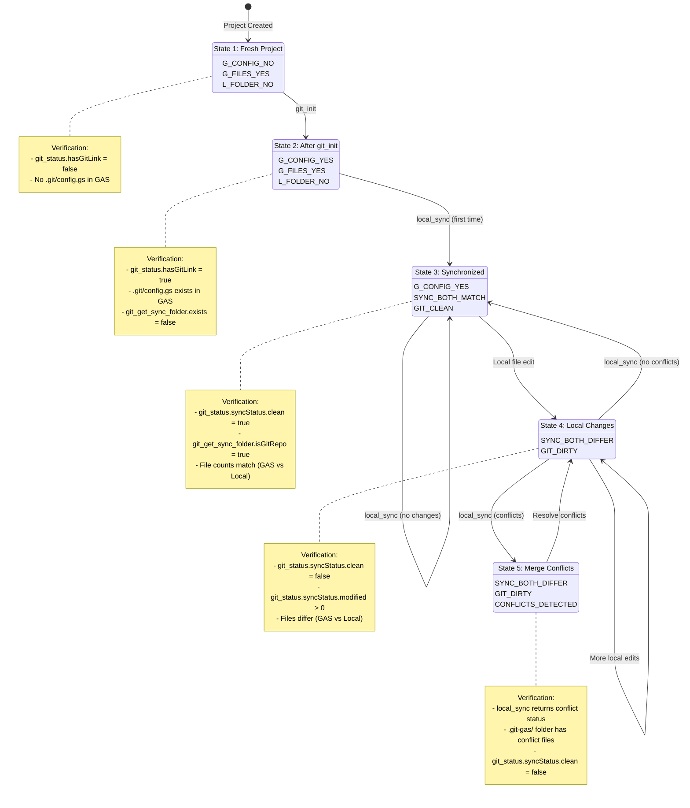
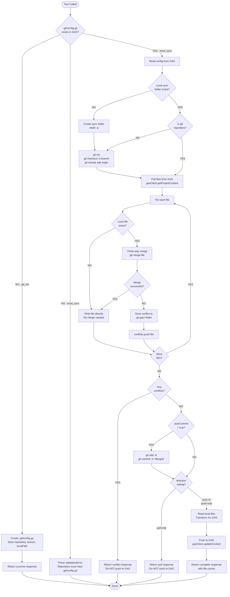
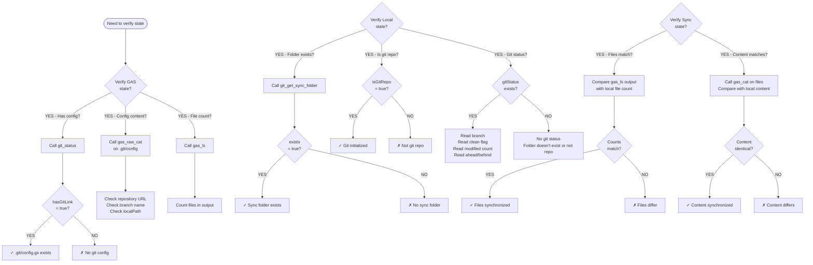

# Git Operations State Transition Matrix

## Overview

This document maps ALL possible state combinations for git operations across two filesystems (GAS and Local) and defines the expected behavior of each MCP tool in each state.

---

## Visual State Transition Diagram



## Tool Operation Flow Diagram



## State Verification Decision Tree



---

---

## State Dimension Framework

### GAS (Remote) States
- **G_CONFIG_YES**: `.git/config.gs` exists in GAS
- **G_CONFIG_NO**: `.git/config.gs` does NOT exist in GAS
- **G_FILES_YES**: User files exist in GAS
- **G_FILES_NO**: No user files in GAS

### Local (Filesystem) States
- **L_FOLDER_YES**: Sync folder exists on filesystem
- **L_FOLDER_NO**: Sync folder does NOT exist
- **L_GIT_YES**: Folder is git repository (has `.git/` directory)
- **L_GIT_NO**: Folder is NOT git repository
- **L_FILES_YES**: User files exist locally
- **L_FILES_NO**: No user files locally

### File Synchronization States
- **SYNC_BOTH_MATCH**: Files exist in both locations with matching content
- **SYNC_BOTH_DIFFER**: Files exist in both locations with different content
- **SYNC_GAS_ONLY**: Files exist ONLY in GAS
- **SYNC_LOCAL_ONLY**: Files exist ONLY locally
- **SYNC_NONE**: No files in either location

### Git Working Directory States (when L_GIT_YES)
- **GIT_CLEAN**: No uncommitted changes
- **GIT_DIRTY**: Uncommitted changes present
- **GIT_AHEAD**: Local commits not pushed to remote
- **GIT_BEHIND**: Remote commits not pulled locally
- **GIT_SYNC**: In sync with remote

---

## Critical State Scenarios

### Scenario 1: Fresh Initialization (Common Starting Point)
**Initial State:**
- G_CONFIG_NO (no .git/config.gs)
- G_FILES_YES (project has code)
- L_FOLDER_NO (no local sync folder)

**Tool: `git_init`**

**Actions:**
1. Creates `.git/config.gs` in GAS with CommonJS module wrapper
2. Stores repository URL, branch, localPath in config
3. Returns success response with configuration summary

**State Transitions:**
- G_CONFIG_NO → G_CONFIG_YES
- L_FOLDER_NO → L_FOLDER_NO (git_init doesn't create local folder)

**Verification Pattern:**
```typescript
// BEFORE
const statusBefore = await client.callTool('mcp__gas__git_status', {scriptId});
expect(statusBefore.hasGitLink).to.be.false;

// ACTION
const initResult = await client.callTool('mcp__gas__git_init', {
  scriptId: testProjectId,
  repository: 'https://github.com/user/repo.git',
  branch: 'main'
});

// VERIFY RESPONSE
expect(initResult.success).to.be.true;
expect(initResult.repository).to.equal('https://github.com/user/repo.git');

// VERIFY STATE (GAS)
const configContent = await client.callTool('mcp__gas__raw_cat', {
  path: `${testProjectId}/.git/config`
});
expect(configContent).to.include('github.com/user/repo');

// VERIFY STATE (status)
const statusAfter = await client.callTool('mcp__gas__git_status', {scriptId});
expect(statusAfter.hasGitLink).to.be.true;
expect(statusAfter.repository).to.equal('https://github.com/user/repo.git');
expect(statusAfter.syncStatus).to.deep.equal({});  // No local repo yet
```

---

### Scenario 2: First Sync After Initialization
**Initial State:**
- G_CONFIG_YES (git_init completed)
- G_FILES_YES (project has code)
- L_FOLDER_NO (no local sync folder yet)
- SYNC_GAS_ONLY (files only in GAS)

**Tool: `local_sync` (direction: "sync")**

**Actions:**
1. Reads config from `.git/config.gs`
2. Creates sync folder with `fs.mkdir(syncFolder, { recursive: true })`
3. Initializes git repo with `git init`
4. Creates branch with `git checkout -b <branch>`
5. Adds remote with `git remote add origin <repository>`
6. Pulls all files from GAS
7. Writes files to local (no merge needed, files don't exist)
8. Auto-commits if autoCommit=true
9. Returns success with file counts

**State Transitions:**
- L_FOLDER_NO → L_FOLDER_YES
- L_GIT_NO → L_GIT_YES
- L_FILES_NO → L_FILES_YES
- SYNC_GAS_ONLY → SYNC_BOTH_MATCH
- GIT_CLEAN (after auto-commit)

**Verification Pattern:**
```typescript
// BEFORE
const folderBefore = await client.callTool('mcp__gas__git_get_sync_folder', {scriptId});
expect(folderBefore.exists).to.be.false;

// ACTION
const syncResult = await client.callTool('mcp__gas__local_sync', {
  scriptId: testProjectId,
  direction: 'sync',
  autoCommit: true
});

// VERIFY RESPONSE
expect(syncResult.status).to.equal('complete');
expect(syncResult.pulledCount).to.be.greaterThan(0);
expect(syncResult.pushedCount).to.equal(0);  // No changes to push back

// VERIFY STATE (local folder)
const folderAfter = await client.callTool('mcp__gas__git_get_sync_folder', {scriptId});
expect(folderAfter.exists).to.be.true;
expect(folderAfter.isGitRepo).to.be.true;
expect(folderAfter.gitStatus.clean).to.be.true;

// VERIFY STATE (status)
const statusAfter = await client.callTool('mcp__gas__git_status', {scriptId});
expect(statusAfter.syncStatus.branch).to.equal('main');
expect(statusAfter.syncStatus.clean).to.be.true;
expect(statusAfter.syncStatus.modified).to.equal(0);

// VERIFY STATE (file count - use filesystem check or gas_ls)
const lsResult = await client.callTool('mcp__gas__ls', {scriptId});
const gasFileCount = (lsResult.content[0].text.match(/\n/g) || []).length;
expect(syncResult.pulledCount).to.equal(gasFileCount);
```

---

### Scenario 3: Sync with Local-Only Changes
**Initial State:**
- G_CONFIG_YES
- G_FILES_YES (original files)
- L_FOLDER_YES
- L_GIT_YES
- L_FILES_YES (modified locally)
- SYNC_BOTH_DIFFER (local has uncommitted changes)
- GIT_DIRTY (uncommitted local changes)

**Tool: `local_sync` (direction: "sync")**

**Actions:**
1. Pulls files from GAS
2. For each file:
   - If exists locally: three-way merge using `git merge-file`
   - If new in GAS: write directly
3. Detects conflicts if merge fails
4. If no conflicts and autoCommit=true: commits merged result
5. Pushes merged result back to GAS

**State Transitions:**
- SYNC_BOTH_DIFFER → SYNC_BOTH_MATCH (if no conflicts)
- GIT_DIRTY → GIT_CLEAN (after auto-commit)

**Verification Pattern:**
```typescript
// BEFORE - Create local modification
// (Assume we've done local_sync once already, now modifying local file)
const statusBefore = await client.callTool('mcp__gas__git_status', {scriptId});
expect(statusBefore.syncStatus.modified).to.be.greaterThan(0);
expect(statusBefore.syncStatus.clean).to.be.false;

// ACTION
const syncResult = await client.callTool('mcp__gas__local_sync', {
  scriptId: testProjectId,
  direction: 'sync',
  autoCommit: true
});

// VERIFY RESPONSE
expect(syncResult.status).to.equal('complete');
expect(syncResult.pulledCount).to.be.greaterThan(0);
expect(syncResult.pushedCount).to.be.greaterThan(0);  // Local changes pushed back

// VERIFY STATE (git clean)
const statusAfter = await client.callTool('mcp__gas__git_status', {scriptId});
expect(statusAfter.syncStatus.clean).to.be.true;
expect(statusAfter.syncStatus.modified).to.equal(0);

// VERIFY STATE (files synchronized)
const folderInfo = await client.callTool('mcp__gas__git_get_sync_folder', {scriptId});
expect(folderInfo.gitStatus.clean).to.be.true;
```

---

### Scenario 4: Sync with Merge Conflicts
**Initial State:**
- G_CONFIG_YES
- G_FILES_YES (modified remotely in GAS)
- L_FOLDER_YES
- L_GIT_YES
- L_FILES_YES (modified locally - same lines as remote)
- SYNC_BOTH_DIFFER (conflicting changes)
- GIT_DIRTY

**Tool: `local_sync` (direction: "sync")**

**Actions:**
1. Pulls files from GAS
2. Attempts three-way merge with `git merge-file`
3. Detects conflict (exit code 1 from git merge-file)
4. Writes conflict markers to `.git-gas/` folder
5. Returns conflict response with file list
6. Does NOT push back to GAS
7. Does NOT auto-commit

**State Transitions:**
- SYNC_BOTH_DIFFER → SYNC_BOTH_DIFFER (conflicts remain)
- GIT_DIRTY → GIT_DIRTY (still has uncommitted changes + conflicts)

**Verification Pattern:**
```typescript
// BEFORE
const statusBefore = await client.callTool('mcp__gas__git_status', {scriptId});
expect(statusBefore.syncStatus.clean).to.be.false;

// ACTION
try {
  const syncResult = await client.callTool('mcp__gas__local_sync', {
    scriptId: testProjectId,
    direction: 'sync',
    autoCommit: true
  });

  // If conflicts, should return conflict status (not throw)
  expect(syncResult.status).to.equal('conflict');
  expect(syncResult.conflicts).to.be.an('array');
  expect(syncResult.conflicts.length).to.be.greaterThan(0);
} catch (error: any) {
  // Alternatively might throw with conflict details
  expect(error.message).to.include('conflict');
}

// VERIFY STATE (still dirty)
const statusAfter = await client.callTool('mcp__gas__git_status', {scriptId});
expect(statusAfter.syncStatus.clean).to.be.false;

// VERIFY STATE (conflicts saved)
const folderInfo = await client.callTool('mcp__gas__git_get_sync_folder', {scriptId});
// Check that .git-gas/ folder exists with conflict files (filesystem check)
```

---

### Scenario 5: Pull-Only Mode (No Push Back)
**Initial State:**
- G_CONFIG_YES
- G_FILES_YES (modified in GAS)
- L_FOLDER_YES
- L_GIT_YES
- L_FILES_YES (older version)
- SYNC_BOTH_DIFFER
- GIT_CLEAN

**Tool: `local_sync` (direction: "pull-only")**

**Actions:**
1. Pulls files from GAS
2. Merges with local files
3. Auto-commits if autoCommit=true
4. Does NOT push back to GAS (stops after local merge)

**State Transitions:**
- SYNC_BOTH_DIFFER → SYNC_GAS_ONLY (local updated to match GAS)
- GIT_CLEAN → GIT_CLEAN (after auto-commit)

**Verification Pattern:**
```typescript
// BEFORE
const lsBefore = await client.callTool('mcp__gas__ls', {scriptId});
const gasFilesBefore = lsBefore.content[0].text;

// ACTION
const syncResult = await client.callTool('mcp__gas__local_sync', {
  scriptId: testProjectId,
  direction: 'pull-only',
  autoCommit: true
});

// VERIFY RESPONSE
expect(syncResult.status).to.equal('pull');  // Different from 'complete'
expect(syncResult.pulledCount).to.be.greaterThan(0);
expect(syncResult.pushedCount).to.equal(0);  // No push in pull-only mode

// VERIFY STATE (GAS unchanged)
const lsAfter = await client.callTool('mcp__gas__ls', {scriptId});
expect(lsAfter.content[0].text).to.equal(gasFilesBefore);

// VERIFY STATE (local updated and clean)
const statusAfter = await client.callTool('mcp__gas__git_status', {scriptId});
expect(statusAfter.syncStatus.clean).to.be.true;
```

---

### Scenario 6: Push-Only Mode (Still Pulls First!)
**Initial State:**
- G_CONFIG_YES
- G_FILES_YES (older version)
- L_FOLDER_YES
- L_GIT_YES
- L_FILES_YES (modified locally)
- SYNC_BOTH_DIFFER
- GIT_DIRTY

**Tool: `local_sync` (direction: "push-only")**

**CRITICAL**: Even "push-only" ALWAYS pulls first for safety!

**Actions:**
1. STILL pulls files from GAS first (safety mechanism)
2. Merges with local files
3. Auto-commits if autoCommit=true
4. Pushes merged result to GAS

**State Transitions:**
- SYNC_BOTH_DIFFER → SYNC_BOTH_MATCH
- GIT_DIRTY → GIT_CLEAN (after auto-commit and push)

**Verification Pattern:**
```typescript
// BEFORE
const lsBefore = await client.callTool('mcp__gas__ls', {scriptId});
const gasFileCountBefore = (lsBefore.content[0].text.match(/\n/g) || []).length;

// ACTION
const syncResult = await client.callTool('mcp__gas__local_sync', {
  scriptId: testProjectId,
  direction: 'push-only',
  autoCommit: true
});

// VERIFY RESPONSE
expect(syncResult.status).to.equal('complete');
expect(syncResult.pulledCount).to.be.greaterThan(0);  // STILL pulls first!
expect(syncResult.pushedCount).to.be.greaterThan(0);

// VERIFY STATE (GAS updated)
const lsAfter = await client.callTool('mcp__gas__ls', {scriptId});
const gasFileCountAfter = (lsAfter.content[0].text.match(/\n/g) || []).length;
expect(gasFileCountAfter).to.be.greaterThan(gasFileCountBefore);

// VERIFY STATE (local clean)
const statusAfter = await client.callTool('mcp__gas__git_status', {scriptId});
expect(statusAfter.syncStatus.clean).to.be.true;
```

---

### Scenario 7: Empty Project Sync
**Initial State:**
- G_CONFIG_YES
- G_FILES_NO (empty project, only CommonJS.js)
- L_FOLDER_NO
- SYNC_NONE

**Tool: `local_sync` (direction: "sync")**

**Actions:**
1. Creates sync folder and initializes git
2. Pulls files from GAS (only gets CommonJS.js and .git/config.gs)
3. Writes files locally
4. Auto-commits
5. No files to push back (nothing changed)

**State Transitions:**
- L_FOLDER_NO → L_FOLDER_YES
- L_GIT_NO → L_GIT_YES
- SYNC_NONE → SYNC_GAS_ONLY (only system files)
- GIT_CLEAN

**Verification Pattern:**
```typescript
// BEFORE
const lsBefore = await client.callTool('mcp__gas__ls', {scriptId});
const gasFileCount = (lsBefore.content[0].text.match(/\n/g) || []).length;
expect(gasFileCount).to.be.lessThan(3);  // Only CommonJS and .git/config

// ACTION
const syncResult = await client.callTool('mcp__gas__local_sync', {
  scriptId: testProjectId,
  direction: 'sync',
  autoCommit: true
});

// VERIFY RESPONSE
expect(syncResult.status).to.equal('complete');
expect(syncResult.pulledCount).to.be.lessThan(3);  // Few files
expect(syncResult.pushedCount).to.equal(0);

// VERIFY STATE (folder created)
const folderAfter = await client.callTool('mcp__gas__git_get_sync_folder', {scriptId});
expect(folderAfter.exists).to.be.true;
expect(folderAfter.isGitRepo).to.be.true;
```

---

### Scenario 8: No Git Config (Error State)
**Initial State:**
- G_CONFIG_NO (no .git/config.gs)
- G_FILES_YES
- L_FOLDER_NO

**Tool: `local_sync` (any direction)**

**Actions:**
1. Attempts to read config from GAS
2. Finds no `.git/config.gs`
3. Throws ValidationError

**State Transitions:**
- No state change (operation fails)

**Verification Pattern:**
```typescript
// BEFORE
const statusBefore = await client.callTool('mcp__gas__git_status', {scriptId});
expect(statusBefore.hasGitLink).to.be.false;

// ACTION
try {
  await client.callTool('mcp__gas__local_sync', {
    scriptId: testProjectId,
    direction: 'sync'
  });
  expect.fail('Should have thrown error for missing git config');
} catch (error: any) {
  expect(error.message).to.match(/git.*config|not.*git-linked|repository.*must have/i);
}

// VERIFY STATE (unchanged)
const statusAfter = await client.callTool('mcp__gas__git_status', {scriptId});
expect(statusAfter.hasGitLink).to.be.false;

const folderAfter = await client.callTool('mcp__gas__git_get_sync_folder', {scriptId});
expect(folderAfter.exists).to.be.false;
```

---

### Scenario 9: Sync Folder Location Change
**Initial State:**
- G_CONFIG_YES (with old localPath)
- L_FOLDER_YES (at old location)
- L_GIT_YES

**Tool: `git_set_sync_folder`**

**Actions:**
1. Reads current `.git/config.gs` from GAS
2. Updates localPath in config
3. Writes updated `.git/config.gs` back to GAS
4. Optionally moves existing git repo to new location if moveExisting=true

**State Transitions:**
- Config localPath: oldPath → newPath
- If moveExisting=true: L_FOLDER_YES (old) → L_FOLDER_NO (old), L_FOLDER_YES (new)

**Verification Pattern:**
```typescript
// BEFORE
const folderBefore = await client.callTool('mcp__gas__git_get_sync_folder', {scriptId});
expect(folderBefore.syncFolder).to.equal('/old/path');

// ACTION
const setResult = await client.callTool('mcp__gas__git_set_sync_folder', {
  scriptId: testProjectId,
  localPath: '/new/path',
  moveExisting: true
});

// VERIFY RESPONSE
expect(setResult.syncFolder).to.equal('/new/path');
expect(setResult.moved).to.be.true;

// VERIFY STATE (config updated)
const configContent = await client.callTool('mcp__gas__raw_cat', {
  path: `${testProjectId}/.git/config`
});
expect(configContent).to.include('/new/path');
expect(configContent).to.not.include('/old/path');

// VERIFY STATE (folder location)
const folderAfter = await client.callTool('mcp__gas__git_get_sync_folder', {scriptId});
expect(folderAfter.syncFolder).to.equal('/new/path');
expect(folderAfter.exists).to.be.true;
expect(folderAfter.isGitRepo).to.be.true;
```

---

## State Detection Tool Behavior

### `git_status`

| GAS State | Local State | Returns |
|-----------|-------------|---------|
| G_CONFIG_NO | * | `{ hasGitLink: false, message: "Use git_init", recommendedActions: {...} }` |
| G_CONFIG_YES + L_FOLDER_NO + L_GIT_NO | * | `{ hasGitLink: true, repository: "...", localRepo: "...", syncStatus: {} }` |
| G_CONFIG_YES + L_FOLDER_YES + L_GIT_YES + GIT_CLEAN | * | `{ hasGitLink: true, syncStatus: { branch, clean: true, modified: 0, ahead: 0, behind: 0 } }` |
| G_CONFIG_YES + L_FOLDER_YES + L_GIT_YES + GIT_DIRTY | * | `{ hasGitLink: true, syncStatus: { branch, clean: false, modified: N, ... } }` |

### `git_get_sync_folder`

| GAS State | Local State | Returns |
|-----------|-------------|---------|
| G_CONFIG_NO | * | `{ syncFolder: null, exists: false, isGitRepo: false }` |
| G_CONFIG_YES + L_FOLDER_NO | * | `{ syncFolder: "...", exists: false, isGitRepo: false, gitStatus: null }` |
| G_CONFIG_YES + L_FOLDER_YES + L_GIT_NO | * | `{ syncFolder: "...", exists: true, isGitRepo: false, gitStatus: null }` |
| G_CONFIG_YES + L_FOLDER_YES + L_GIT_YES | * | `{ syncFolder: "...", exists: true, isGitRepo: true, gitStatus: { branch, clean, modified, ... } }` |

---

## Complete State Transition Table

### State Combinations (Subset - Most Common)

| # | G_CONFIG | G_FILES | L_FOLDER | L_GIT | L_FILES | SYNC_STATE | Scenario Name |
|---|----------|---------|----------|-------|---------|------------|---------------|
| 1 | NO | YES | NO | NO | NO | GAS_ONLY | Fresh initialization |
| 2 | YES | YES | NO | NO | NO | GAS_ONLY | After git_init, before first sync |
| 3 | YES | YES | YES | YES | YES | BOTH_MATCH | Synchronized state |
| 4 | YES | YES | YES | YES | YES | BOTH_DIFFER | Local modifications |
| 5 | YES | YES | YES | YES | YES | BOTH_DIFFER_CONFLICT | Merge conflicts |
| 6 | YES | NO | YES | YES | YES | LOCAL_ONLY | Local ahead of GAS |
| 7 | YES | YES | YES | YES | NO | GAS_ONLY | Local deleted files |
| 8 | NO | YES | YES | YES | YES | ERROR | Invalid state (no config but has local) |

### Tool Effects on Each State

#### State 1 → State 2 (git_init)
- **Action**: Creates `.git/config.gs` in GAS
- **Transition**: G_CONFIG_NO → G_CONFIG_YES
- **Local**: No change
- **Verify**: gas_raw_cat .git/config, git_status.hasGitLink

#### State 2 → State 3 (local_sync first time)
- **Action**: Creates folder, init git, pulls files, commits
- **Transition**: L_FOLDER_NO → L_FOLDER_YES, L_GIT_NO → L_GIT_YES, L_FILES_NO → L_FILES_YES, SYNC_GAS_ONLY → SYNC_BOTH_MATCH
- **Verify**: git_get_sync_folder.exists, git_status.syncStatus.clean

#### State 3 → State 4 (local file edit)
- **Action**: User edits files locally (outside MCP)
- **Transition**: SYNC_BOTH_MATCH → SYNC_BOTH_DIFFER, GIT_CLEAN → GIT_DIRTY
- **Verify**: git_status.syncStatus.modified > 0

#### State 4 → State 3 (local_sync with no conflicts)
- **Action**: Pulls GAS, merges, commits, pushes
- **Transition**: SYNC_BOTH_DIFFER → SYNC_BOTH_MATCH, GIT_DIRTY → GIT_CLEAN
- **Verify**: git_status.syncStatus.clean, sync result pushedCount > 0

#### State 4 → State 5 (local_sync with conflicts)
- **Action**: Attempts merge, detects conflicts
- **Transition**: Remains in SYNC_BOTH_DIFFER, GIT_DIRTY remains
- **Verify**: Sync result status = 'conflict', git_status.syncStatus.clean = false

---

## Test Implementation Template

```typescript
describe('Git State Transition: [Scenario Name]', () => {
  it('should transition from [Initial State] to [Final State]', async function() {
    this.timeout(TEST_TIMEOUTS.BULK);

    // SETUP: Create initial state
    // ... setup code ...

    // BEFORE: Verify initial state
    const statusBefore = await client.callTool('mcp__gas__git_status', {scriptId});
    expect(statusBefore.hasGitLink).to.equal([expected]);

    const folderBefore = await client.callTool('mcp__gas__git_get_sync_folder', {scriptId});
    expect(folderBefore.exists).to.equal([expected]);
    expect(folderBefore.isGitRepo).to.equal([expected]);

    // ACTION: Perform state transition
    const result = await client.callTool('mcp__gas__[tool]', {
      scriptId: testProjectId,
      // ... parameters ...
    });

    // VERIFY RESPONSE
    expect(result.status).to.equal([expected]);
    expect(result.[property]).to.[assertion];

    // VERIFY FINAL STATE (GAS)
    const configAfter = await client.callTool('mcp__gas__raw_cat', {
      path: `${testProjectId}/.git/config`
    });
    expect(configAfter).to.include([expected]);

    // VERIFY FINAL STATE (status)
    const statusAfter = await client.callTool('mcp__gas__git_status', {scriptId});
    expect(statusAfter.hasGitLink).to.equal([expected]);
    expect(statusAfter.syncStatus.clean).to.equal([expected]);

    // VERIFY FINAL STATE (folder)
    const folderAfter = await client.callTool('mcp__gas__git_get_sync_folder', {scriptId});
    expect(folderAfter.exists).to.equal([expected]);
    expect(folderAfter.isGitRepo).to.equal([expected]);
  });
});
```

---

## Key Insights for Test Design

1. **Always Pull First**: Even "push-only" mode pulls first for safety
2. **State Detection**: Use `git_status` and `git_get_sync_folder` to verify state
3. **File Verification**: Use `gas_ls`, `gas_cat` to verify GAS state
4. **Conflict Handling**: Verify conflicts are detected and saved to `.git-gas/`
5. **Auto-commit**: Verify clean git state after auto-commit operations
6. **Empty Projects**: Test with projects that have no user files
7. **Error Cases**: Test missing config, invalid script IDs, permission errors

---

## Complete Verification Checklist

For each git operation test:

- [ ] **BEFORE**: Verify initial GAS state (has config? has files?)
- [ ] **BEFORE**: Verify initial local state (folder exists? is git repo? has files?)
- [ ] **BEFORE**: Verify initial sync state (files in both? matching? differing?)
- [ ] **ACTION**: Execute tool with appropriate parameters
- [ ] **VERIFY RESPONSE**: Check response status and counts
- [ ] **VERIFY GAS**: Check .git/config.gs content if applicable
- [ ] **VERIFY GAS**: Check file count/content via gas_ls/gas_cat
- [ ] **VERIFY LOCAL**: Check folder exists via git_get_sync_folder
- [ ] **VERIFY LOCAL**: Check is git repo via git_get_sync_folder
- [ ] **VERIFY LOCAL**: Check git status (clean/dirty) via git_status
- [ ] **VERIFY SYNC**: Verify file counts match expectations

---

## Conclusion

This matrix provides comprehensive coverage of all meaningful state combinations for git operations. Tests should be designed to:

1. Set up specific initial states
2. Execute state transitions via tool calls
3. Verify ALL state dimensions after transition
4. Use multiple verification tools to cross-check state

The key principle: **Never assume state - always verify explicitly**.
